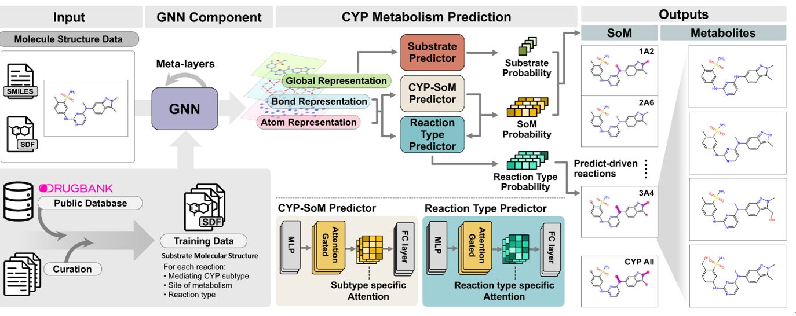

## CYP-MAP: Multi-Level GNN Model for Site of Metabolism Prediction


### Overview
CYP-MAP is a multi-level graph neural network (GNN) model designed to predict sites of metabolism (SoM) by Cytochrome P450 (CYP) enzymes, which play a key role in drug metabolism. By analyzing the molecular structure of drug candidates, CYP-MAP identifies potential metabolic sites, reaction types, and CYP450 subtypes. Developed using experimentally validated metabolic data from DrugBank and other sources, the model integrates global, bond, and atom-level representations to capture both local reactivity and broader molecular properties. This predictive capability supports drug optimization for improved efficacy and safety.

## Supported Environment
- **Operating Systems**: Linux (Ubuntu 18.04 or higher recommended)
- **Programming Language**: Python 3.8 or higher
- **GPU Support**: CUDA 11.8 or higher (multi-GPU support)

## 📦 Installation

This project is tested and recommended to run on Ubuntu (Linux) environments with Python 3.9+ and GPU support.

```bash
git clonehttps://github.com/qwon135/CYP-MAP.git
cd CYP-MAP
```
### ⚠️ CUDA Runtime Requirement

This project uses PyTorch with GPU acceleration, and requires:

- ✅ NVIDIA GPU (with at least 6–8GB VRAM recommended)
- ✅ Driver version ≥ 520 (supports CUDA 11.8)
- ✅ CUDA 11.8 Runtime

💡 Our experiments typically use 4–6GB of VRAM, but for stable training and inference, we recommend using a GPU with at least 8GB VRAM.

You do not need to install the full CUDA Toolkit — the runtime only is enough.

✅ You can check your driver version with:
```bash
nvidia-smi
```

🔗 Download CUDA 11.8 Runtime:
- MetaboGNN is tested with CUDA 11.8. If `nvidia-smi` does not work or your driver is outdated, install the CUDA 11.8 runtime (used in our experiments) 
- here: 👉 https://developer.nvidia.com/cuda-11-8-0-download-archive

### 🧪 Environment Setup (with conda)

```bash
conda create -n cypmap python=3.9
conda activate cypmap

# Install PyTorch 2.1 + CUDA 11.8
conda install pytorch==2.1.2 pytorch-cuda=11.8 -c pytorch -c nvidia

# Install DGL with CUDA 11.8
conda install -c dglteam/label/th21_cu118 dgl

# Install PyTorch Geometric (PyG)
conda install conda-forge::pytorch_geometric
conda install pytorch-scatter=2.1.2 -c pyg
conda install pytorch-sparse=0.6.18 -c pyg

# 📝 Note:
# Make sure the CUDA versions match across PyTorch, DGL, and PyG.
# If any installation fails, try upgrading pip & setuptools:
# python -m pip install --upgrade pip setuptools
pip install -r requirements.txt
```

- Estimated Installation Time: Typical installation time: approximately 5-10 minutes (may vary depending on environment and internet speed)

## Project Structure

```bash
MetaboGNN/
CYP-MAP/
│
├── modules/                 # Core modules for molecule processing and model components
│   ├── som_models.py        # Main CYP-MAP model definition (GNN architecture)
│   ├── som_dataset.py       # Dataset class for molecular graph inputs
│   └── dualgraph/           # Utilities for dual-graph processing 
│
├── pretrain/                # Graph Contrastive Learning (GCL) pretraining code
│   ├── run_pretrain.py           # For single-GPU  pretraining
│   ├── run_pretrain_parallel.py # Distributed (multi-GPU) pretraining script
│   ├── save_graph_pretrain.py   # Saves graphs as torch tensors for pretraining
│   └── ckpt_pretrain/            # Directory for storing pretrained model checkpoints
│
├── output_module/           # Postprocessing module to convert predictions into SDF/metabolite format
│
├── infer.py                 # Inference script using the trained model
├── train.py                 # Main training script for CYP-SoM prediction
├── save_graph.py            # Utility to save processed graphs
├── utils.py                 # General-purpose utility functions
│
├── requirements.txt         # Python dependencies for the project
└── README.md                # Project documentation and usage instructions

```

## How to Run
### 1. Pretraining
1. Prepare Pretraining Data
   ```bash
   cd pretrain
   tar -zxvf pretrain_data.tar.gz
   python save_graph_pretrain.py
   ``` 

2. Pretrain: Graph Contrastive Learning

   Option A: Multi-GPU (Distributed Data Parallel)
   If you have multiple GPUs (e.g., 4), run the following command for distributed pretraining:

   ```bash
   cd pretrain   
   CUDA_VISIBLE_DEVICES=0,1,2,3 python -u -m torch.distributed.run --nproc_per_node=4 --nnodes=1 --master_port 12312 run_pretrain_parallel.py
   ```

   Option B: Single GPU
   If you have only one GPU, run the following simpler command:

   ```bash
   cd pretrain   
   python run_pretrain.py
   ```

   Skip Pretraining (Optional)
   A pretrained GNN model is already provided at:

   ```bash
   pretrain/ckpt_pretrain/gnn_pretrain.pt

   ```
   
   After Pretraining
   ```bash
   cd ..

   ```
### 2. Fine-tuning Experiments

1. Prepare Fine-tuning Graph
   ```bash
   python save_graph.py
   ```

2. Train Model
   ```bash
   python train.py --seed 42
   ```

3. Inference
   ```bash
   python -u infer.py --ckpt ckpt/42.pt --th 0.15
   ```

## Demo Execution
How to run the model with example data:
```bash
python -u infer.py --demo
```
- In demo mode, 1000 molecules are randomly sampled from the test set for inference.
- Inference is performed with batch size = 1.
- Execution speed is similar between CPU and GPU.
- On an NVIDIA RTX 4090 (24GB), processing 1000 molecules takes approximately 28 seconds.
- On CPU, the same task takes approximately 32 seconds.
- This mode is useful for quick testing or demonstration of model outputs without training the model or preparing a full dataset.

## Command Line Usage

### When the input is SMILES:
```bash
python output_module --smiles 'CC1=C(C=C(C=C1)NC2=NC=CC(=N2)N(C)C3=CC4=NN(C(=C4C=C3)C)C)S(=O)(=O)N' --subtype sub9 --base_dir "./output_dir/"
```

### When the input is Structural Data File (SDF):
```bash
python output_module --sdf "./data/example_molecule.sdf" --subtype sub9 --base_dir "./output_dir/"
python output_module --sdf "./data/example_molecule.sdf" --subtype sub9 --mode broad --base_dir "./output_dir/"
```

### Input Type Options:
- `--smiles`: SMILES string of the molecule
- `--sdf`: Path to the SDF file

### CYP450 Mode (--subtype):
- `--subtype`: Subtype to predict. Options: 'sub9', 'all'
  - **all (All)**: A model trained on molecules metabolized by all 9 CYP450 subtypes without distinction
  - **sub9 (9 Subtypes)**: A model trained to distinguish between the 9 CYP450 subtypes, providing detailed predictions for each subtype

### Prediction Window (--mode):
- `--mode`: Prediction mode. Options: 'default', 'broad'
  - **Default**: An optimized option without coverage constraints
  - **Broad**: An option optimized under the condition of 80% SOM (Site of Metabolism) coverage

### Output Type:
- `--output_type`: Type of output to generate (e.g., default, only-som, json)

### Output Path:
- `--base_dir`: Base directory to save outputs

### Algorithm Description
- CYP-MAP uses molecular graph representation and graph neural networks to predict drug metabolism sites. Key features:

### Self-supervised graph contrastive learning
- Utilization of atomic and bond properties of molecular structures
- Prediction of metabolism sites for various CYP isoforms

## Example Dataset
- `data/` directory contains the following files:
  - `cyp_map_train.sdf`: Training data for known CYP reactions
  - `Decoys_cypreact_Drug_like.sdf`: Training data with molecules that have no known CYP reactions
  - `cyp_map_test.sdf`: Specially curated test dataset for model evaluation
  - `cyp_map_train_with_decoy.sdf`: Combined dataset containing both CYP reactions (from cyp_map_train) and decoy molecules
  - `example_molecule.sdf`: A single-molecule SDF file containing Nirmatrelvir, provided as an example input for demonstrating CYP-MAP execution.
